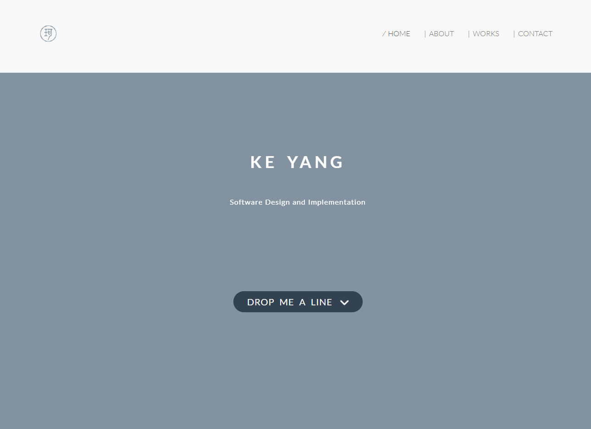

# yangke.me

[](https://yangke-nz.github.io/yangke.me/)
[](https://vitejs.dev/)
[](https://getbootstrap.com/)
[](LICENSE)

## Personal CV website rebuild using npm and vite

[](https://yangke-nz.github.io/yangke.me/)

```
npm install

npm run dev      # dev server on http://localhost:9000

npm run build    # build into docs/

npm run preview  # serve the built docs/ locally
```

The build output is committed to `docs/`, which GitHub Pages serves directly from
the default branch. Rebuild before committing so `docs/` stays in sync with `src/`.

Assets are emitted with relative paths, so `docs/index.html` also works when
opened straight off disk without a server.

## License

The source code is released under the [MIT License](LICENSE).

The CV content itself -- the biography, employment history, project write-ups,
photographs and the personal logo -- is not covered by that license and remains
(c) Ke Yang, all rights reserved. Reuse the code freely; please don't republish
the personal material.
